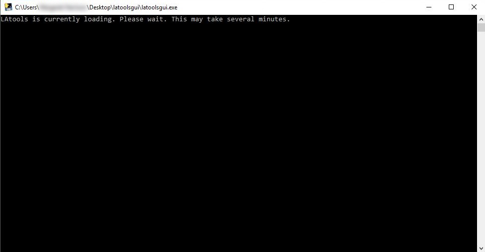

.. _installing_LAtools:

######################
Installing LAtools GUI
######################

.. note:: It may take a few minutes for the LAtools GUI to load the first time you use it on your computer.

.. warning:: You computer may warn you that the software is from an unknown developer. Please disregard this warning.

For Windows
***********

1. Download the *latoolsgui_win.zip* archive file.
2. Unzip the *latoolsgui_win.zip* archive file.
3. Open the *latoolsgui_win* folder, then open the *latoolsgui* folder. The :guilabel:`latoolsgui.exe` file will be in this folder (you may have to search for it in your file explorers search bar). Double click this file to load Latools GUI. This may take a few minutes. You will see the following screen while it loads.

        .. image:: gifs/loading_cmd.JPG
                :width: 689px
                :height: 496px
                :scale: 70 %
                :alt: loading please wait
                :align: center

4. Once loaded, you will see the following screen. You are now ready to start using LAtools GUI.

.. image:: gifs/title_screen.JPG
        :width: 689px
        :height: 496px
        :scale: 80 %
        :alt: title screen
        :align: center

Now, head on over to the :ref:`beginners_guide`, which steps you through an entire example data analysis.

For Mac
*******

1. Download the *latoolsgui_mac.zip* archive file.
2. Unzip the *latoolsgui_mac.zip* archive file.
3.  Open the *latoolsgui_win* folder, then open the *latoolsgui* folder. The :guilabel:`latoolsgui.exe` file will be in this folder (you may have to search for it in your file explorers search bar). Double click this file to load Latools GUI. This may take a few minutes. You will see the following screen while it loads.

4. Once loaded, you will see the following screen. You are now ready to start using LAtools GUI.

.. image:: gifs/title_screen.JPG
        :width: 689px
        :height: 496px
        :scale: 80 %
        :alt: title screen
        :align: center

Now, head on over to the :ref:`beginners_guide`, which will take you through an example analysis session.
