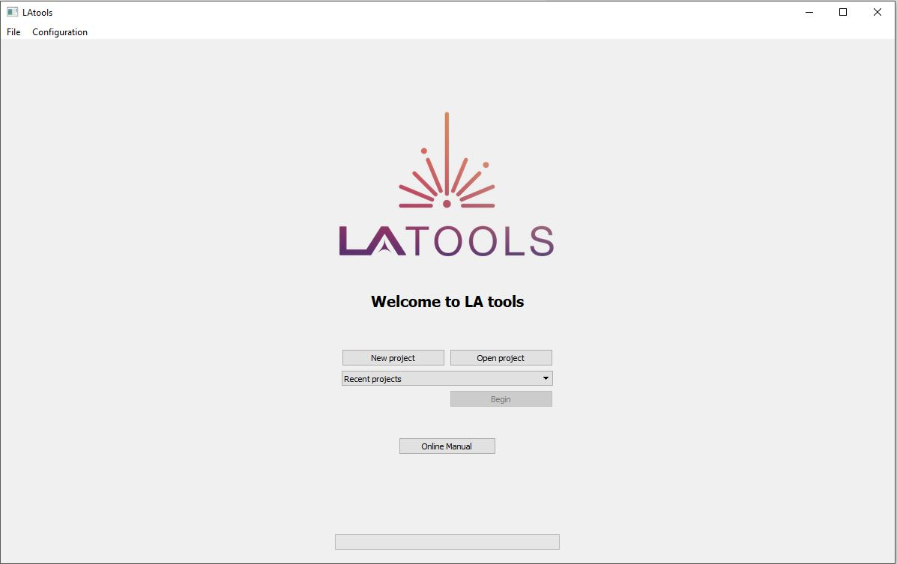

.. _installing_LAtools:

######################
Installing LAtools GUI
######################

.. note:: it may take a few minutes for LAtools GUI to load if it is the  first time you are using it on your computer.

To use LAtools GUI:

For Windows
***********

1. Download the latoolsgui_win.zip archive file.
2. Unzip the latoolsgui_win.zip archive file. This may take a few minutes.
3. Go into latoolsgui_win -> latoolsgui then find the latoolsgui.exe file. You may have to search for it in your file explorers search bar. Double click this file to open Latools. You will see the following screen while it loads.

        .. image:: gifs/loading_cmd.JPG
                :width: 689px
                :height: 496px
                :scale: 60 %
                :alt: loading please wait
                :align: center

4. Once LAtools is loaded, you will see the following screen. You are now ready to start your analysis session!

For Mac
*******

1. Download the latoolsgui_mac.zip archive file.
2. Unzip the latoolsgui_mac.zip archive file. This may take a few minutes.
3. Go into latoolsgui_mac -> latoolsgui then find the latoolsgui.exe file. Double click this file to open Latools. You may have to search for it in your file explorers search bar. Double click this file to open Latools. You will see the following screen while it loads.

.. need pic

4. Once LAtools is loaded, you will see the following screen. You are now ready to start your analysis session!

.. need pic

