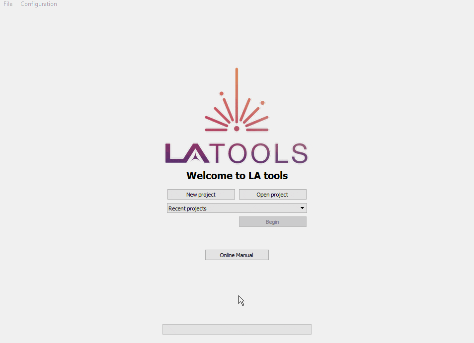

Starting a project
******************

Welcome to LAtools! This short tutorial will guide you through an entire analysis session using sample ablation data included with LAtools. We highly recommend working through this example to understand the mechanics of the software before working on your own data.

.. where will the data be? still default?

Project Options
===============
LAtools allows you to create new projects, or open existing projects that you or someone else has created. In this tutorial, we will be creating a new project.

Creating a new project
----------------------
To create a new project, click :guilabel:`&New project`. Type the name of your new project in the :guilabel:`&Project name` dialogue box - in this example, we are going to call the project **LAtools_Demo**. Click :guilabel:`&Begin` to start.

.. _existing-project:
Opening an existing project
---------------------------
If you would like to open an existing project, click :guilabel:`&Open project`. This will open your computers file explorer. Navigate to the location of your project, then open the file. This action will drop you into the last step that was completed in that particular analysis session.

.. note:: Project files have a **.lalog** file extension.

Recent projects
---------------

You can also open existing projects from the :guilabel:`&Recent projects`  drop down menu. Simply click :guilabel:`&Recent projects` and select the project you would like to open. Then click :guilabel:`&Begin`. If the project you wish to open is not there, you will have to manually find and open it using the :ref:`Opening an existing project` method.

