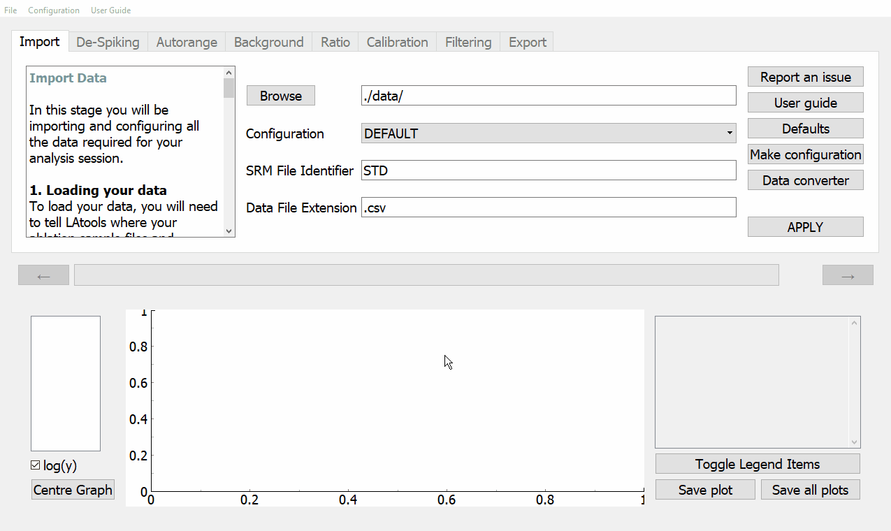

.. _import:
Stage 1. Data Import
********************

This is the beginning of the analysis session. In this stage, you will:

    - Load your data and standards
    - Choose or create a configuration
    - State your standards identifier
    - Specify the file extension of your data files

Selecting your data and standards
=================================
To start the analysis session, you will need to load your data. The data used for this tutorial is stored within the ``latools`` directory under **latools_gui\\data**. This directory contains the following files:

    -   Sample-1.csv
    -   Sample-2.csv
    -   Sample-3.csv
    -   STD-1.csv
    -   STD-2.csv

For this tutorial, ``latools`` will automatically load the data, so no change is required.

Using your own data
-------------------
If you wish to use your own data, you will need to place all your data and standards into a single folder.  Then, you have two options (most likely option 2):

1. If you know your data is formatted in an LAtools configuration, load the data by opening your computers file explorer by clicking :guilabel:`&Browse`, then navigate to the folder containing all your files. Then click open.

2. If you data files are not in an LAtools configuration, you will need to convert your files to the default configuration. For instructions, see the :ref:`converting_files` page.

Configuring LAtools
===================
A configuration stores information about the way your data is formatted, and where on your computer your SRM tables are saved. In this example, we will use the **DEFAULT** configuration.

If you are using your own data and have used the converter to convert them to the **DEFAULT** configuration, then use the  **DEFAULT** configuration.

Specifying a SRM identifier
===========================
The SRM identifier identifies which of your files contain standard reference materials. By default, this value is set to **'STD'**. This means that any data file with **'STD'** in its name will be flagged as an SRM.  When using your own data, you need to have a unique identifier in your standard file names - it can be **'STD'** or some other string. You can specify your SRM identifiers by modifying the :guilabel:`&SRM Identifier` input field.

In this tutorial, we have loaded two SRMs: STD-1.csv and STD-2.csv. No change to this field is required.

Data file extension
===================
Lastly, you will need to specify the extension type of the files you are using. All the files used in this tutorial are .csv files. The default value for this is **.csv**. For this tutorial, no change  to this field is required.

If your files are not .csv files,  you will need to type it into the :guilabel:`&Data File Extension` input field.

Start plotting!
===============
To plot your data, click :guilabel:`&APPLY`. Your data plots will be visible in the plotting panel.

Make sure you data looks correct!
