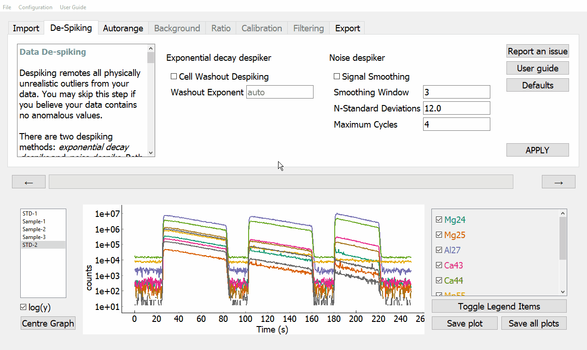
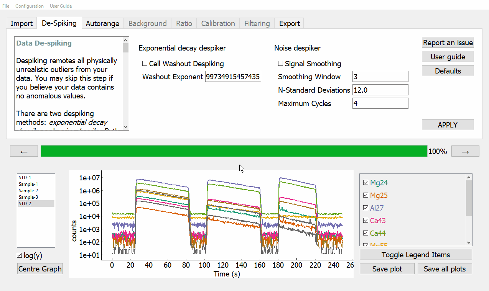

Stage 2. Data despiking
***********************

In this stage, you will 'despike' the raw data to remove physically unrealistic outliers (i.e. higher than is physically possible based on your system setup). LAtools provides two despiking methods - **Cell Washout Despiking** and **Signal Smoothing**. You can modify several parameters that change of behaviour of these methods.

In this tutorial, we will apply both despiking methods.

.. tip:: You can skip this step if you wish by simply clicking on the :guilabel:`&->` or the Autorange tab.

Cell Washout Despiking
======================

:guilabel:`&Cell Washout Despiking` removes all the low outliers in your data, based on the signal washout time of your laser cell. The signal washout is described using an exponential decay function. If the measured signal decreases faster than physically possible based on your laser setup, these points are removed, and replaced with the average of the adjacent values. The following list details the different parameters this function uses.

* Exponent
    If you know the exponential decay constant that describes the washout characteristics of your laser ablation cell, you can enter this value in the :guilabel:`&Washout Exponent` dialogue box. If you do not know this value, leave the :guilabel:`&Washout Exponent` dialogue box blank. LAtools will automatically calculate it for you by fitting an exponential decay function to the washout phase of measured SRMs in your data. The value will be displayed in the :guilabel:`&Washout Exponent` dialogue box.

.. can we show that value?

To apply this method, tick the :guilabel:`&Cell Washout Despiking` check box, change any parameters as necessary (in this tutorial, we will change none), then click :guilabel:`&APPLY`.

Signal Smoothing
================
:guilabel:`&Signal Smoothing` removes high outliers by calculating a rolling mean and standard deviation, and replacing points that are greater than n standard deviations above the mean with the mean of the adjacent data points. The following list details the different parameters this function uses.

* Smoothing Window
    This value is the window used to calculate rolling statistics. This value defaults to **3**. This value must be of type :meth:`~int`.

* N-Standard Deviations
	This value is number of standard deviations above the rolling mean above which data are considered outliers. This value defaults to **12**. This value must be of type :meth:`~float`.

* Maximum Cycles
	This value is the max number of times that the filter is applied. This value must be of type :meth:`~int`.

To apply the exponential decay despike, tick the :guilabel:`&Signal Smoothing` check box, change any parameters you require (in this tutorial, we will change none), then click :guilabel:`&APPLY`.

.. tip:: You can apply both filters at the same time by checking both boxes and then clicking :guilabel:`&APPLY`
