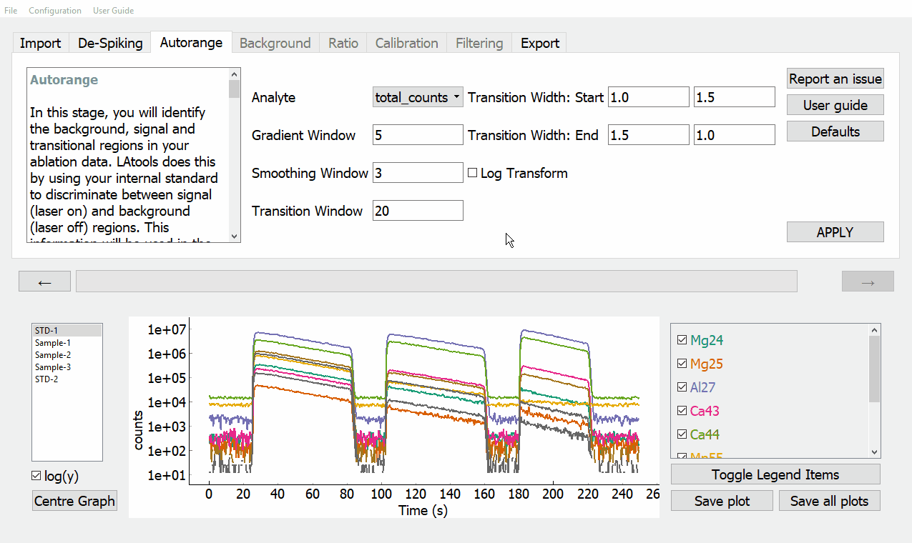

Stage 3. Autorange
******************
In this stage, you will identify and separate background and signal regions in your data. For this tutorial, we will use the default settings. To do this, simply click :guilabel:`&APPLY`. Both signal (shaded grey) and noise (shaded red) regions will be identified in the graphing panel.

There are several parameters that can be modified to subtly alter the behaviour of this function. However, in testing the automatic separation proved remarkably robust, and you should not have to change these parameters much. If you would like to know more about these parameters, see :ref:`Parameters`.

What's happening to my data?
============================
.. taken from http://latools.readthedocs.io/en/latest/users/beginners/5-signal-background.html

Fundamentally, ‘laser on’ regions will contain high counts, while ‘laser off’ will contain low counts of the internal standard. The mid point between this high and low offers a good starting point to approximately identify ‘signal’ and ‘background’ regions. Regions in the ablation with higher counts than the mid point are labelled ‘signal’, and lower are labelled ‘background’. However, because the transition between laser-on and laser-off is not instantaneous, both signal and background identified by this mid-point will contain part of the ‘transition’, which must be excluded from both signal and background. This is accomplished by a simple algorithm, which determines the width of the transition and excludes it:

    1. Extract each approximate transition, and calculate the first derivative. As the transition is approximately sigmoid, the first derivative is approximately Gaussian.
    2. Fit a Gaussian function to the first derivative to determine its width. This fit is weighted by the distance from the initial transition guess.
    3. Exclude regions either side of the transitions from both signal and background regions, based on the full-width-at-half-maximum (FWHM) of the Gaussian fit. The pre- and post-transition exclusion widths can be specified independently for ‘off-on’ and ‘on-off’ transitions.

Parameters
==========
If you would like to alter any of the parameters, simply enter the new value in its corresponding dialogue box or drop down menu. Once you are happy with your parameters, click :guilabel:`&APPLY`.

* Analyte
    The analyte you would like to use to discriminate between signal and background. 'total_counts' normally gives best results.

* Gradient Window
    The width (number of data points) of the window used to calculate the first derivative of the smoothed signal. This value must be of type :meth:`~int`.

* Smoothing Window
    The width (number of data points) of the window used to smooth the raw data. This value must be of type :meth:`~int`.

* Transition Window
    The number of points either side of identified transitions to include when determining transition width. This value must be of type :meth:`~int`.

* Transition Width\: Start
    The amount of the data to exclude before and after 'laser on' transitions. Defined relative to the overall width of the transition. This value must be of type :meth:`~float`.

* Transition Width\: End
    The amount of the data to exclude before and after 'laser off' transitions. Defined relative to the overall width of the transition. This value must be of type :meth:`~float`.

* Initial Transition Sensitivity
    The mean number of points in each histogram bin used to identify approximate laser on/off transitions. Lower numbers will increase the sensitvity to identifying transitions, but if it's too low you might start picking up background oscillations. ~10 usually works well. This value must be of type :meth:`~float`.

* Log Transform
    If your signals are highly heterogeneous, log transformation can make Autorange work better. Simply tick the :guilabel:`&Log transform` check box to turn this option on.
