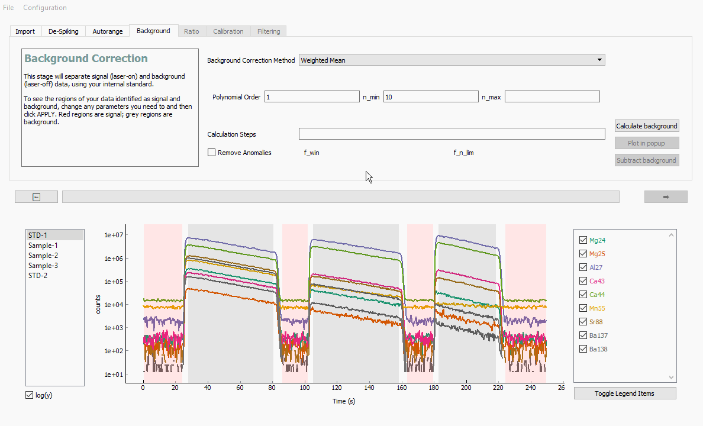
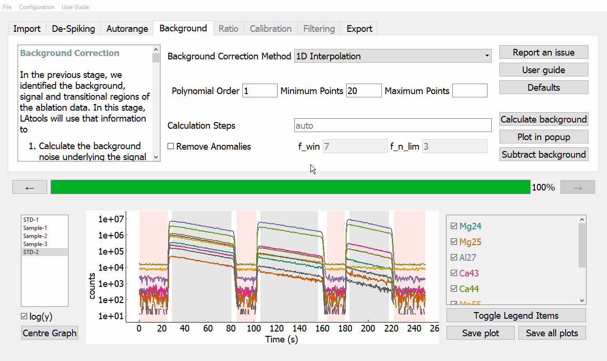
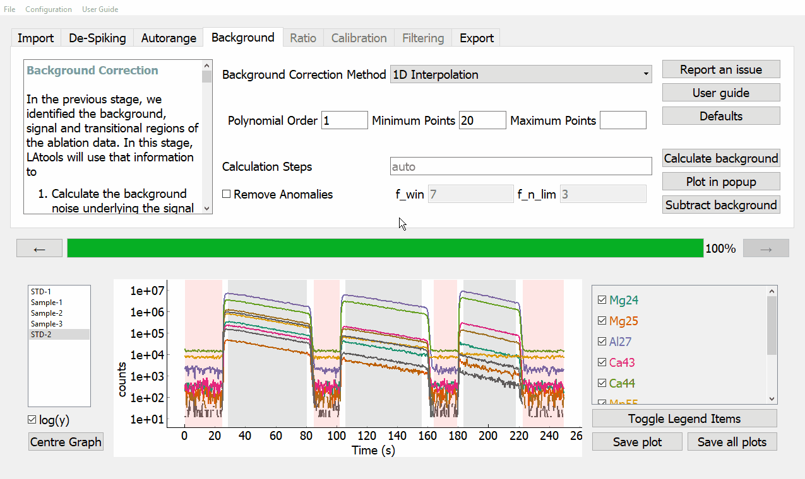

Stage 4. Background
*******************

There are two parts to the background stage. First, we will calculate and then remove the background underlying the signal regions; then we will subtract the background from the signal regions.

Calculating background
======================
LAtools has two background calculation algorithms that you can use:

* Background calculation using 1D interpolation
	This method fits a polynomial function to all background regions, and calculates the intervening background values using a 1D interpolation (numpy’s interp1D function). The order of the polynomial can be specified by the ‘kind’ variable, where kind=0 simply interpolates the mean background forward until the next measured background region.

* Background calculation using a weighted mean
	This method calculates a Gaussian-weighted moving average, such that the interpolated background at any given point is determined by adjacent background counts on either side of it, with the closer (in Time) being proportionally more important. The full-width-at-half-maximum (Gaussian FWHM) of the Gaussian weights must be specified, and should be greater than the time interval between background measurements, and less than the time-scale of background drift expected on your instrument.

To use any of them, simply select the method from the drop down menu, change any parameters you require, the click :guilabel:`&APPLY`.

.. warning:: Use extreme caution with polynomial backgrounds of order>1. You should only use this if you know you have significant non-linear drift in your background, which you understand but cannot be dealt with by changing your analytical procedure. In all tested cases the weighted mean background outperformed the polynomial background calculation method.

In this tutorial, we will be using the first method, 1D interpolation. Change the :guilabel:`&Gaussian FWHM` to 5 minutes (300 seconds), and then change :guilabel:`&Minimum Points` to 20.

To view the plot of the resulting background, click :guilabel:`&Plot in popup`. If you are having trouble navigating this plot panel, click here :ref:`Navigating the plotting panels`.

Removing background
===================
To subtract the background from the signal regions, simply click :guilabel:`&Subtract background`. The plot panel will now show your background corrected data.

