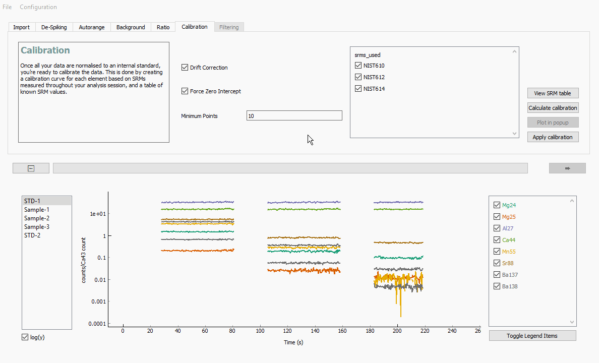
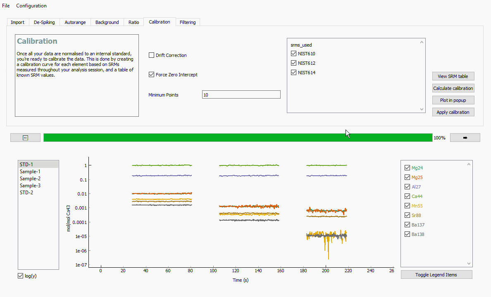

Stage 6. Calibration Calculation
********************************

In this stage, we will be calibrating your data. We will do this by creating a calibration curve for each element, based on SRMs measured throughout your analysis session, and a table of known SRM values.

You can either calculate a single calibration from a combination of all your measured standards, or generate a time-sensitive calibration to account for sensitivity drift through an analytical session. The latter is achieved by creating a separate calibration curve for each element in each SRM measurement, and linearly extrapolating these calibrations between neighbouring standards.

Parameters
----------
There are three parameters that can be modified to subtly alter the behaviour of this function.

* Drift correct
	Whether to interpolate calibration parameters between SRM measurements

* Force zero intercept
	Whether to force calibration lines through zero (y = mx) or not (y = mx + c).

* Minimum points
	The minimum number of data points an SRM measurement must have to be included. Default value is **10**.

In this tutorial, our analytical session is very short, so we are not worried about sensitivity drift. Make sure that the :guilabel:`&Drift correct` check box is unticked.

We will however tick the :guilabel:`&Force Zero Intercept` check box, which fits a polynomial calibration line to the data that is forced through zero.

SRMs used contains the list of SRMs measured throughout the analysis. These are automatically detected by ``latools`` based on your configuration.

To apply the changes, click on :guilabel:`&Calculate Calibration`, then :guilabel:`&Apply Calibration`. ``latools`` will now calculate a calibration curve for each analyte based on your measured and known SRM values, and apply the calibration to all samples.

To view the calibration lines for each analyte, click on :guilabel:`&Plot in popup`. Each panel in this plot shows the measured counts/count (x axis) vs. known mol/mol (y axis) for each analyte with associated errors, with the fitted calibration line, equation and R2 of the fit. The axis on the right of each panel contains a histogram of the raw data from each sample, showing where your sample measurements lie compared to the range of the standards.

