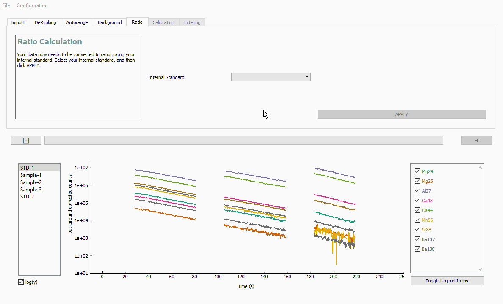

Stage 5. Ratio
**************

In this stage, we will normalise the data to an internal standard. Select the internal standard you would like to use by clicking on the :guilabel:`&Internal Standard` drop down menu, then apply it by clicking :guilabel:`&APPLY`. In this example, we will use Ca43, meaning all analytes will be divided by Ca43.

.. note:: LAtools works entirely in ratios from here on. This avoids cumbersome assumptions regarding bulk sample composition required to attain absolute analyte concentrations, and makes processing and error propagation numerically simpler. If you require absolute concentrations, these may be calculated from the ratio values at the end of data processing, as long as you know the concentration of the internal standard in your samples.
