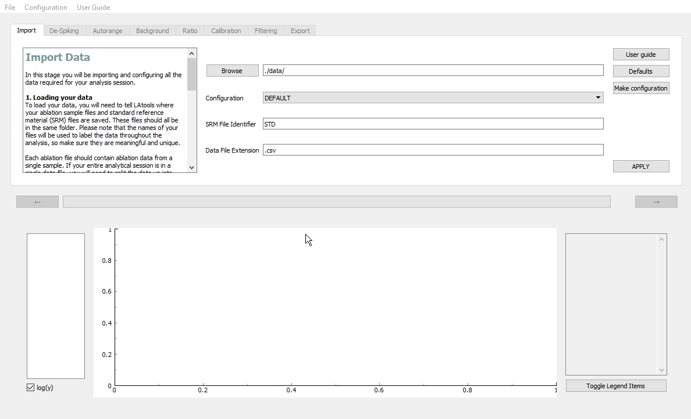

.. _create_configuration:

###################
Configuring LAtools
###################

.. warning:: ``latools`` **will not work** if incorrectly configured. Follow the instructions below carefully.

Like all software, LAtools is stupid. It won't be able to read your data or know the composition of your reference materials, unless you tell it how.

1. Data Format Description
==========================
Mass specs produce a baffling range of different data formats, which can also be customised by the user.
Creating a built-in data reader that can handle all these formats is impossible.
You'll therefore have to write a description of your data format, which LAtools can understand.

The complexity of this data format description will depend on the format of your data, and can vary from a simple 3-4 line snippet, to a baffling array of heiroglyphics. We appreciate that this may be something of a barrier to the beginner.

To make this process as painless as possible, we've put together a step-by-step guide on how to approach this is in the :ref:`data_formats` section.

If you get stuck, head on over to the `mailing list <https://groups.google.com/forum/#!forum/la>`_, and ask for help.

2. Modify/Make a SRM database File
==================================
This contains raw compositional values for the SRMs you use in analysis, and is essential for calibrating your data.
LAtools comes with `GeoRem <http://georem.mpch-mainz.gwdg.de/>`_ 'preferred' compositions for NIST610, NIST612 and NIST614 glasses.
If you use any other standards, or are unhappy with the GeoRem 'preferred' values, you'll have to create a new SRM database file.

Instructions on how to do this are in :ref:`srm_file` guide.
If you're happy with the GeoRem values, and only use NIST610, NIST612 and NIST614, you can skip this step.

3. Configure LAtools
====================
Once you've got a data description and SRM database that you're happy with, you can create a configuration in ``latools``.

To create a configuration you will need to create a new project. Then,

1. Click on :guilabel:`&Configuration` -> :guilabel:`&Make`.
2. Name your configuration (something meaningful!)
3. Direct LAtools to your data format file by clicking on :guilabel:`&Browse` and opening the folder it is saved in.
4. Direct LAtools to your SRM file by clicking on :guilabel:`&Browse` and opening the folder it is saved in.
5. Click on :guilabel:`&Create Configuration`.

You will now be able to select your new configuration from the :guilabel:`&Configuration` drop down menu in the Import stage.

