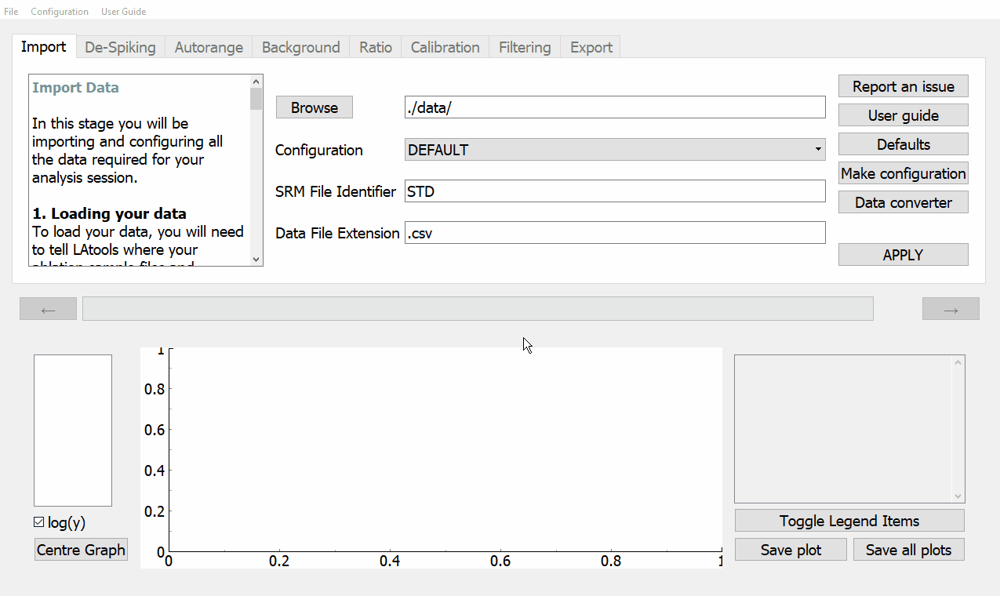

.. _converting_files:

################
Converting Files
################

.. warning:: ``latools`` **will not work** if incorrectly configured. Follow the instructions below carefully.

LAtools will not be able to understand your data if it does not know what format it is in. To combat the wide variety of formats used in the laser ablation community, we have built a file converter that will take your files and convert them into the LAtools default.

To do this:

1. Click on :guilabel:`&Data converter`.
2. In the :guilabel:`&Run conversion on a` drop down menu, choose if you are converting a single file or a folder of files.
3. Select the folder where your (un-converted) files are saved by clicking on :guilabel:`&Find data file`.
4. Select the folder where you want your converted files to be saved by clicking on the :guilabel:`&Export location`.
5. Run the converted by clicking on :guilabel:`&Convert`. LAtools may ask you a series of questions about the date of your data, which you must answer correctly.
6. Once your data has been converted, you will see a message saying your data has been converted successfully. Close the converter.
7. You can now :ref:`import` your data into LAtools. Make sure your converted data folder also contains your SRMs.

.. warning:: Look at your data and files to make sure they are correct! If you're having problems with this, please :ref:`contact_us` so we can help you import your data.